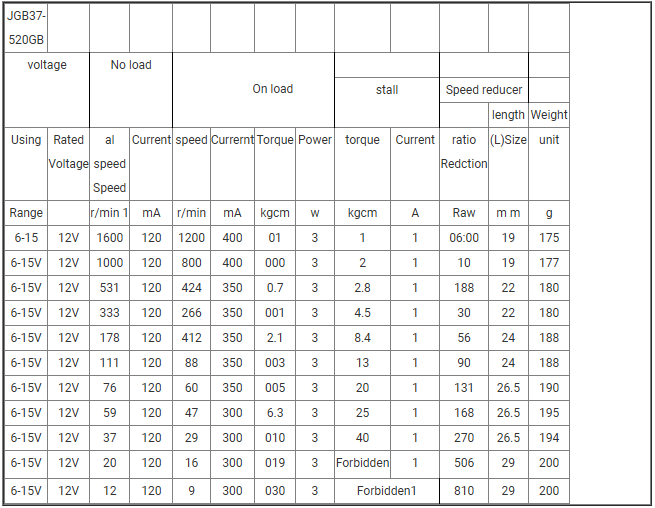

# JGB37-520 STM32 HAL 드라이버

STM32 HAL 기반의 JGB37-520 엔코더 모터 제어용 드라이버입니다.  
STM32의 Encoder Mode와 L298D 모터 드라이버를 활용하여 엔코더 모터 제어했습니다.

Encoder의 Pulse 신호를 사용해 모터의 회전 상태를 1ms 마다 받습니다.  
받는 신호를 통해 회전 속도, 회전 방향, 누적 거리를 측정 가능합니다.  
자율 주행 차량에서 특정 거리만큼 이동하거나 속도를 유지해야 할 때 유용합니다.

## 📂 프로젝트 구조
```
ProjectRoot/
├── App/
│   ├── device/        # 외부 디바이스(센서 등) 드라이버 폴더
│   │   ├── motor_encoder.h
│   │   ├── motor_encoder.c
│   │   ├── pid_control.h
│   │   └── pid_control.c
│   └── ap.c           # 실제 동작을 위한 예제 코드
```

## 📜 데이터 시트




출처 : https://www.aslongdcmotor.com/sale-14417223-aslong-jgb37-520gb-electric-dc-gear-motor-hall-encoder-1600rpm.html  
출처 : https://ko.aliexpress.com/item/1005005437166978.html?  


## CubeMX 설정
### JGB37-520 설정
```
Motor Supply Voltage : 12V
Encoder Supply Voltage : 3.3V / 5V
```

#### TIM 32bit
```
Mode: Combined Channels > Encoder Mode

Parameter Settings:
- Encoder Mode: TI1 and TI2
- Counter Mode: Up
- Counter Period: 0xFFFFFFFF (32bit 최대값)
- Prescaler: 0
- Polarity: Rising Edge

NVIC: Global Interrupt Enable
```
#### 모터 PWM 제어용
```
Mode: 
- Channel1: PWM Generation CH1
- Channel2: PWM Generation CH2  

Parameter Settings:
- Prescaler: 899 (APB2 클럭이 180MHz일 때)
- Counter Mode: Up
- Counter Period: 999 (1kHz PWM 주파수)
- Pulse: 0 (초기 듀티사이클 0%)
- PWM Mode: PWM mode 1
```

#### L298N 제어를 위한 추가 GPIO 설정
```
GPIO Output pins:
- PB0: Motor1_DIR1 (IN1)
- PB1: Motor1_DIR2 (IN2)

GPIO Mode: Output Push Pull
GPIO Pull-up/Pull-down: No pull-up and no pull-down
Maximum output speed: High
```

## Encoder 모터 원리

```
2배 증배 (Rising Edge만):
A: ___┌─────┐_______┌─────┐___
B: ______┌─────┐_______┌─────┐_
        1     2       3     4
        ↑     ↑       ↑     ↑
      A상승  B상승    A상승  B상승

4배 증배 (Rising + Falling Edge):
A: ___┌─────┐_______┌─────┐___
B: ______┌─────┐_______┌─────┐_
         1 2 3 4       5 6 7 8
      ↑  ↑  ↓  ↓    ↑  ↑  ↓  ↓
       모든 엣지에서 카운트
```

### JGB37-520 Encoder Specification

- 동작 전압 : 12V  
- RPM : 333RPM (회전축이 1분 동안 회전한 횟수)
- PPR : 11 (축이 한 바퀴 회전할 때 발생하는 펄스(Pulse) 수)
- 기어비 옵션 : 30
- 엔코더 해상도 : 모터 1회전 당 -> 11 Pulse x 기어비 x 4채배

-> 내가 사용할 때 배터리 전압 10.5V  
따라서, 최대 RPM 295 출력.  
290RPM = 333RPM * 10.5V / 12V   


## 엔코더 관련 계산
* 회전 방향 = A/B 채널 위상 차로 결정 (A 선행 → 시계방향, B 선행 → 반시계방향)
* RPM → 회전 속도 = 카운트 변화량(ΔCount) / (CPR × 샘플링 주기) → RPS → RPM 변환
* 누적 엔코더 카운트 → 위치(각/거리)
  * 각도 (출력축 기준) : 누적 카운트 ÷ CPR × 2π → 라디안
  * 선형 거리 (바퀴 접지 기준, 선택) : 각도 × 반지름 → 누적 거리


## 각도 제어 및 거리 측정 하기 전 PID 설명

* 기법: PID = P(비례) + I(적분) + D(미분)
* 목표값에 빠르고 안정적으로 도달하기 위해
* 효과

  * P: 즉각적인 추종(빠름) but 잔여오차 가능

  * I: 잔여오차 제거(정확) but 과하면 출렁임·오버슈트

  * D: 변화 억제(댐핑)로 진동/오버슈트 감소 but 노이즈 민감 → 저역통과 필요

## 엔코더 모터 제어
* 원하는 각도 회전
  * 현재 각도 s_thetaRad 기준 상대 회전
  * 튜닝 팁
     * 튕겨지는 현상이 강하면 Ki 높이기
     * 달달 떠는 현상이 강하면 Ki 낮추기
* 원하는 속도 회전
  * 모터의 현재 속도(s_rpm)와 목표 속도(d_rpm)의 차이를 계산하여 제어
    * 모터의 반응이 너무 느리면 Kp를 높이기
    * 모터가 목표 속도를 지나쳐 오버슈트(overshoot)가 발생하면 Kd를 높여 진동을 줄이기
